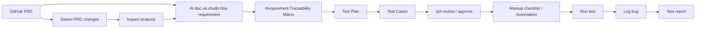

# QA AI Workflow Starter

Project này lưu bộ quy trình khởi tạo để dùng AI hỗ trợ kiểm thử từ PRD trên GitHub đến test plan, test case, automation, bug log và report.

Mục tiêu không phải là cho AI tự động làm hết ngay từ đầu. Mục tiêu là xây dựng một **QA AI System of Record**: mọi requirement, test case, bug và report đều có ID, có traceability, có lịch sử review, và có thể được cập nhật khi PRD thay đổi.

## Luồng chuẩn



## Bắt đầu nhanh

Nếu bạn đang có link PRD và chưa biết đi từ đâu, mở trước:

- [Bắt đầu từ link PRD](qa-ai-workflow/START_HERE.md)

1. Đưa PRD hoặc link PRD GitHub vào `qa-ai-workflow/prd-sources/`.
2. Dùng prompt trong `qa-ai-workflow/prompts/01-requirement-analyst.md` để tạo requirement.
3. Lưu requirement vào `qa-ai-workflow/requirements/`.
4. Tạo test plan từ `qa-ai-workflow/templates/test-plan.template.md`.
5. Tạo test case từ `qa-ai-workflow/templates/test-cases.template.yaml`.
6. Cập nhật traceability ở `qa-ai-workflow/traceability/`.
7. Khi PRD thay đổi, dùng `qa-ai-workflow/prompts/06-change-impact-analyst.md` để phân tích impact.

## Chuẩn ID

- Requirement: `REQ-<MODULE>-001`
- Test case: `TC-<MODULE>-001`
- Bug: `BUG-<MODULE>-001`

Ví dụ:

- `REQ-AUTH-001`
- `TC-AUTH-001`
- `BUG-AUTH-001`

Nguyên tắc traceability:

```text
Bug -> Test Case -> Requirement -> PRD section
```

## Các giai đoạn triển khai

1. Manual + AI support: đọc PRD, tạo requirements, test plan, test cases, QA review.
2. Traceability + update detection: phát hiện PRD thay đổi và impact.
3. Automation có kiểm soát: chỉ automation các case ổn định, high-value, regression.
4. Tích hợp bug/report: Jira, GitHub Issues hoặc Azure DevOps.
5. Dashboard: coverage, status, defect trend, risk.

## Tài liệu chính

- [Bối cảnh từ đoạn chat ban đầu](qa-ai-workflow/docs/project-context.md)
- [Quy trình chi tiết](qa-ai-workflow/README.md)
- [Workflow chuẩn](qa-ai-workflow/docs/ai-testing-workflow.md)
- [Template test plan](qa-ai-workflow/templates/test-plan.template.md)
- [Template test cases](qa-ai-workflow/templates/test-cases.template.yaml)
- [Template traceability](qa-ai-workflow/templates/traceability.template.md)
